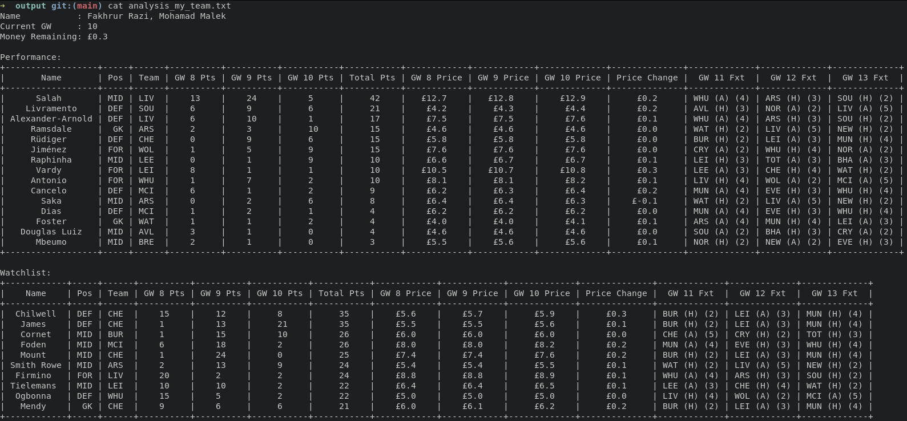

# Introduction
Created based on [amosbastian/fpl](https://github.com/amosbastian/fpl) with the intention to make better call in [Fantasy Premier League](https://fantasy.premierleague.com/).

# Feature
1. Analyze team and sort by points.
2. Analyze top 10k teams.
3. Analyze your league.

# Installation
`pip install -r requirements.txt`

# Credentials
All credentials are stored in `fpl_credentials.py`:
1. Username & password
2. League ID

# Usage
Each of available scripts has a simple cheatsheet by adding `-h` switch.
* `analysis_my_team.py`
```
> python analysis_my_team.py -h
usage: analysis_my_team.py [-h] [-id USER_ID] [-l LOG_IN]

Analyse FPL team

optional arguments:
  -h, --help            show this help message and exit

at least one of these arguments are required:
  -id USER_ID, --user_id USER_ID
                        User ID. Can be obtained in FPL Points's URL.
  -l LOG_IN, --log_in LOG_IN
                        Enable login. Email & Password must be set in fpl_credentials.py.
```

* `analysis_top_10k.py`
```
WIP
```

# Sample Output
* `analysis_my_team.py`
<p align="center">
  
</p>

* `analysis_top_10k.py`
<p align="center">
  
</p>

# Upcoming Features
- [ ] Discord bots
- [ ] DGWs suggestions
