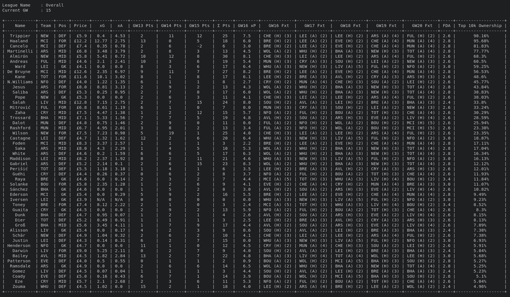

# Introduction
<p align="center">
  
</p>

<p align="center">
  <a href="https://github.com/psf/black"></a>
</p>

Make better calls in [Fantasy Premier League](https://fantasy.premierleague.com/). 

# The Zen of FPL
1. Fixtures over form.
2. Transfers are precious. 
3. Ignore price rises.
4. Avoid confirmation of bias.
5. Luck is a factor.
6. Utilise xG data.

Read Fabio Forges full interview [here](https://fantasyfootballcommunity.com/tips-from-the-worlds-best-fpl-manager/).

# Feature
1. Analyze team and sort by points.
2. Analyze top 10k teams.
3. Analyze your league.

# Installation
`fpl-analysis` uses `poetry` for dependacies management. To install all of them:
```bash
poetry install
```

# Credentials
All credentials are stored in `fpl_credentials.py`:
```python
EMAIL = ""
PASSWORD = "
```

# Usage
Enter virtual environment:
```bash
poetry shell
```

Each of available scripts have a simple cheatsheet by adding `-h` switch.

# Sample Output
* `analysis_team.py`
<p align="center">
  
</p>

* `analysis_top_10k.py`
<p align="center">
  
</p>

# Miscellaneous
[Additional resources](https://fplform.com/fpl-resources#fpl-data-tools)
